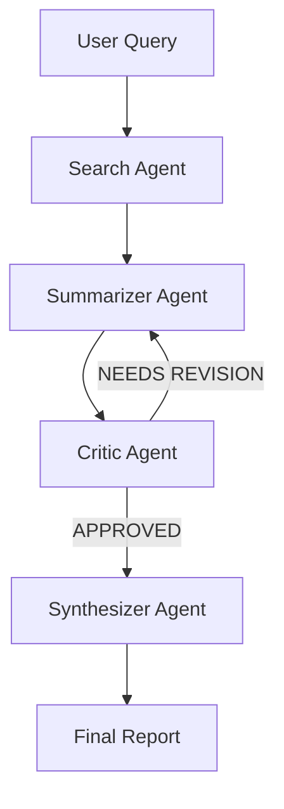

[](https://www.python.org/)
[](https://python.langchain.com/docs/langgraph)
[](https://ollama.com)
[](LICENSE)

## Multi-Agent Research Assistant (Local, LangGraph + Ollama)

This project is a fully local, multi-agent research assistant where four specialized AI agents collaborate (search, summarizer, critic, synthesizer) to answer complex research questions. It uses LangGraph for orchestration, Ollama as the LLM backend, and exposes both a FastAPI API and a Streamlit UI.

### Prerequisites

- Python 3.11+
- [Ollama](https://ollama.com) installed and running
- Pull the required models:

```bash
ollama pull llama3.2
ollama pull nomic-embed-text
```

Make sure the Ollama server is running on `http://localhost:11434` before starting the backend.

### Setup

Install dependencies:

```bash
pip install -r requirements.txt
```

### Run the FastAPI Backend

From the project root (`research_assistant` directory):

```bash
uvicorn api.main:app --reload --port 8000
```

This starts the REST API with:
- `POST /research` to run the multi-agent workflow
- `GET /health` to check status and Ollama model configuration

### Run the Streamlit Frontend

In a separate terminal, from the project root:

```bash
streamlit run ui/app.py
```

Then open `http://localhost:8501` in your browser.

### Architecture

High-level architecture of the system:

```text
                 +-------------------------+
                 |      Streamlit UI       |
                 |   (ui/app.py, port 8501)|
                 +------------+------------+
                              |
                              v
                 +-------------------------+
                 |     FastAPI Backend     |
                 |  (api/main.py, /research)|
                 +------------+------------+
                              |
                              v
                 +-------------------------+
                 |      LangGraph DAG      |
                 |     (graph/workflow)    |
                 +------------+------------+
                              |
      +-----------------------+-----------------------+
      v                       v                       v
+-------------+       +---------------+       +---------------+
| Search      |       | Summarizer    |       | Critic        |
| Agent       |       | Agent         |       | Agent         |
| (DuckDuckGo)|       | (Ollama)      |       | (Ollama)      |
+------+------+       +-------+-------+       +-------+-------+
       |                      |                       |
       +----------------------+                       |
                              v                       |
                      +-------+-------+               |
                      | Synthesizer   |<--------------+
                      | Agent (Ollama)|
                      +---------------+
```

Agent flow in the graph:

```text
START
  ↓
Search Agent  (DuckDuckGo search)
  ↓
Summarizer Agent  (summarize search results)
  ↓
Critic Agent  (APPROVED vs NEEDS REVISION)
  ├─ if "NEEDS REVISION" and iteration < 2 → Summarizer Agent (loop)
  └─ else → Synthesizer Agent
                    ↓
                 END (final report)
```

### LangGraph Agent Flow



## Demo

Add `demo.gif` here showing an end-to-end research run with the multi-agent pipeline.

### Example Research Queries

Try these example queries in the Streamlit UI:

- "What are the latest advances in retrieval-augmented generation for small language models?"
- "Compare strengths and weaknesses of vector databases vs keyword search for enterprise document retrieval."
- "What are the environmental and economic impacts of large-scale data center cooling technologies?"

### Local-Only, No API Keys

- All LLM calls are routed through Ollama running locally via `langchain_ollama.ChatOllama`.
- Web search uses `DuckDuckGoSearchRun` from `langchain_community`, which is free and requires no API keys.
- No OpenAI, Anthropic, or any other paid APIs are used. Everything runs locally as long as Ollama is available.

## Troubleshooting

1. **Ollama timeout**
   - **Symptom**: Requests hang or return 5xx errors when hitting `/research`.
   - **Fix**: Ensure `ollama serve` is running and the model is pulled:
     `ollama pull llama3.2`. If runs are still slow, keep the server warm and avoid
     restarting between requests.

2. **DuckDuckGo rate limit or search errors**
   - **Symptom**: Search agent returns errors from DuckDuckGo or inconsistent results.
   - **Fix**: The search tool already sleeps 1 second between calls; avoid rapid,
     repeated queries. If needed, reduce the number of generated search queries per run.

3. **Port already in use (8000 or 8501)**
   - **Symptom**: FastAPI or Streamlit fails to start with “address already in use”.
   - **Fix**: Stop existing processes bound to those ports (Ctrl+C in old terminals or
     kill stray processes). Alternatively, run on different ports:
     `uvicorn api.main:app --port 8001` and
     `streamlit run ui/app.py --server.port 8502`.


